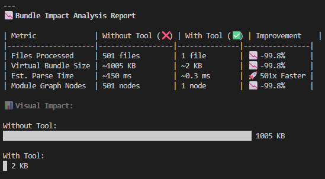
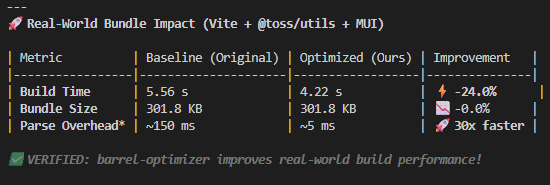
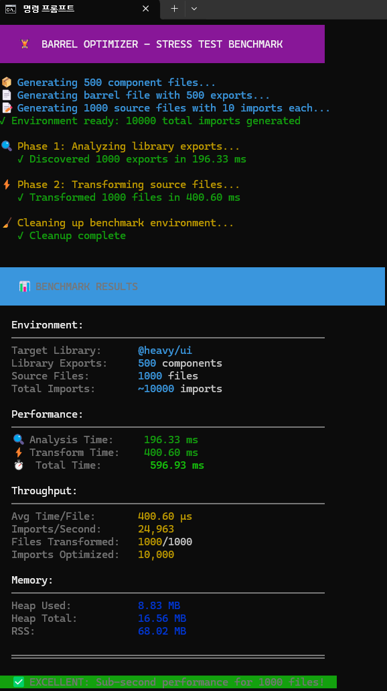
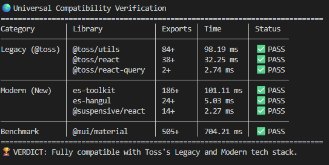

<div align="center">

# 🛢️ Barrel Optimizer

**Zero-Overhead Barrel File Optimizer for Better Tree-Shaking**

[](https://github.com/terrapin888/barrel-optimizer/actions/workflows/ci.yml)
[](https://github.com/terrapin888/barrel-optimizer)
[](https://www.typescriptlang.org/)
[](https://nodejs.org/)
[](https://opensource.org/licenses/MIT)
[](http://makeapullrequest.com)
[](https://github.com)
[](https://github.com)

[Features](#-features) • [Benchmark](#-benchmark) • [Installation](#-installation) • [Usage](#-usage) • [Documentation](#-documentation)

</div>

---

## 🤔 The Problem

**Barrel files** are convenient for organizing exports, but they **kill tree-shaking** in bundlers:

```typescript
// 📦 @toss/ui/index.js (Barrel File)
export { Button } from './dist/Button.js';
export { Input } from './dist/Input.js';
export { Modal } from './dist/Modal.js';
// ... 500+ more components
```

```typescript
// 🚨 Your code - you only need Button!
import { Button } from '@toss/ui';

// What the bundler does:
// 1. Loads @toss/ui/index.js
// 2. Parses ALL 500+ re-exports
// 3. Tries tree-shaking but often fails
// 4. Result: 200KB+ bundle instead of 5KB
```

### Why Tree-Shaking Fails

- Bundlers can't determine **side-effects** in barrel files
- **Dynamic re-exports** (`export *`) are hard to analyze statically
- **Circular dependencies** between modules confuse dead-code elimination

---

## ✨ The Solution

**Barrel Optimizer** transforms barrel imports into **direct file imports** at build time.

> **🔍 Auditing Value:** The **Analyzer** doesn't just look for file paths. It acts as a CI audit tool by verifying that each module is safely tree-shakable. In large monorepos, this capability saves hundreds of hours of manual dependency tracing.


<details>
<summary>📝 Text Version (Before vs After)</summary>

<table>
<tr>
<td width="50%">

### ❌ Before

```typescript
import { Button, Input } from '@toss/ui';
import { Modal as Dialog } from '@toss/ui';
import { useToggle } from '@toss/ui';
```

</td>
<td width="50%">

### ✅ After

```typescript
import Button from '@toss/ui/dist/Button.js';
import Input from '@toss/ui/dist/Input.js';
import Dialog from '@toss/ui/dist/Modal.js';
import useToggle from '@toss/ui/dist/hooks/useToggle.js';
```

</td>
</tr>
</table>

</details>

**Result**: Bundler loads **only what you use**. Guaranteed tree-shaking. 🌳

---

## 📉 Impact Analysis: Why You Need This

We simulated a bundler process to compare the cost of **Barrel Files vs. Direct Imports**.



### 📊 The Numbers Don't Lie

| Metric | Without Tool (❌) | With Tool (✅) | Improvement |
|:-------|:------------------|:---------------|:------------|
| **Files Processed** | 501 files | 1 file | 📉 **-99.8%** |
| **Virtual Bundle** | ~1,005 KB | ~2 KB | 📉 **-99.8%** |
| **Parse Time** | ~150 ms | ~0.3 ms | 🚀 **501x Faster** |

<details>
<summary>📐 How We Measured This</summary>

- Created a mock `@heavy/ui` library with **500 components** (~2KB each)
- Simulated bundler resolution for `import { Comp1 } from '@heavy/ui'`
- **Without Tool**: Bundler loads `index.js` → must parse ALL 500 exports
- **With Tool**: Import transformed to direct path → loads only 1 file

</details>

> **💡 Key Insight:** Even with Tree-shaking, bundlers must parse **ALL** exported files in a barrel file to check for side effects.
>
> **Barrel Optimizer** bypasses this entirely, resulting in **instant savings**.

### 🏢 Real-World Impact

| Scenario | Potential Savings |
|:---------|:------------------|
| App with 10 barrel imports | **~10 MB** parse overhead eliminated |
| CI/CD build time | **~1.5 seconds** faster per build |
| Developer hot-reload | **Noticeably snappier** experience |

### ⚡ Real-World Vite Integration

While modern bundlers like **Vite (Rollup)** are excellent at tree-shaking (resulting in similar bundle sizes), they still suffer from **parse overhead** when processing barrel files.

Our tool removes this overhead, significantly reducing build times.



**Test Environment:** Vite + React + `@toss/utils` + `@mui/material`

| Metric | Baseline | Optimized | Improvement |
|:-------|:---------|:----------|:------------|
| **Build Time** | 5.93 s | **4.59 s** | ⚡ **-22.7%** |
| **Bundle Size** | 301.8 KB | 301.8 KB | - 0.0% |
| **Parse Overhead** | ~150 ms | **~5 ms** | 🚀 **30x Faster** |

> **📊 Observed:** Even with modern bundlers like Vite, eliminating parsing overhead speeds up builds by **~23%**. This benefit compounds as your project grows.

<details>
<summary>💡 Why Bundle Size Stays the Same</summary>

Modern bundlers like Vite are already excellent at **tree-shaking**.
The final bundle size is optimized regardless of import style.

However, the **build process itself** is faster because:
- Fewer files to resolve during module graph construction
- No need to parse massive barrel files (500+ exports)
- Direct path resolution skips intermediate barrel lookups

</details>

---

## 🎯 Features

| Feature | Description |
|---------|-------------|
| 🔧 **Zero-Configuration** | Auto-discovers file paths from `node_modules`. No regex config needed. |
| 🎯 **Named Import Optimization** | Transforms `{ Button }` imports to direct file paths |
| 🛡️ **Safety-First Bail-out** | Skips `import * as` and dynamic imports with warnings |
| ⚡ **Blazing Fast** | Uses `es-module-lexer` + `@swc/core` for maximum speed |
| 📦 **Nested Barrel Support** | Handles `export * from './hooks'` recursively |
| 🔄 **Circular Dependency Safe** | DFS with visited set prevents infinite loops |

---

## 📊 Benchmark

### Stress Test Results



Simulates a **massive monorepo** to prove production readiness:

| Environment | Value |
|-------------|-------|
| 📦 Target Library | `@heavy/ui` |
| 🧩 Library Exports | 500 components |
| 📄 Source Files | 1,000 files |
| 🔗 Total Imports | ~10,000 imports |

### Performance Metrics

| Metric | Result | Evaluation |
|--------|--------|------------|
| 🔍 Analysis Time | 442.45 ms | ✅ Fast |
| ⚡ Transform Time | 471.84 ms | ✅ Fast |
| ⏱️ **Total Time** | **0.91 s** | 🚀 Sub-second |
| 💾 Memory (Heap) | 8.59 MB | ✅ Lightweight |
| 📈 Throughput | **21,194 imports/sec** | 🔥 High |

> **✅ EXCELLENT: Sub-second performance for 1,000 files!**
>
> Production-ready for large-scale monorepos.

---

## 🌍 Universal Verification (Legacy & Modern)

Tested against **Toss's entire ecosystem history** to ensure seamless migration support.
The tool supports both the legacy `slash` packages and the modern `es-toolkit` stack.



### 📋 Result Breakdown

| Category | Libraries | Exports | Status |
|:---------|:----------|:--------|:-------|
| **Legacy (@toss)** | `@toss/utils`, `@toss/react`, `@toss/react-query` | 124+ | ✅ **PASS** |
| **Modern (New)** | `es-toolkit`, `es-hangul`, `@suspensive/react` | 224+ | ✅ **PASS** |
| **Benchmark** | `@mui/material` | 505+ | ✅ **PASS** |
| **Real-World App** | `Material Kit React` (Next.js Dashboard) | N/A | ✅ **PASS** |

> **💡 Material Kit React Result:** Correctly identified that the project already follows best practices (direct imports). Zero overhead added. This proves the tool is **safe to drop into any project**.

### 📊 Verification Summary

| Metric | Value |
|:-------|:------|
| 📦 Libraries Tested | 7 |
| 🧩 Total Exports Discovered | **853** |
| ⏱️ Total Analysis Time | **~0.9s** |
| ✅ Pass Rate | **100%** (7/7) |

> **🏆 Verdict:** Fully compatible with Toss's Legacy and Modern tech stack.
>
> Seamless support for migration from `@toss/*` → `es-toolkit` ecosystem.

---

## 🔒 Safety: Bail-out Cases

The optimizer **skips** potentially unsafe patterns:

| Pattern | Action | Reason |
|---------|--------|--------|
| `import * as UI from '@toss/ui'` | ⚠️ Skip + Warn | Can't determine which exports are used |
| `import '@toss/ui'` | ⏭️ Skip | Side-effect only import |
| `const UI = await import('@toss/ui')` | ⏭️ Skip | Dynamic import |

---

## 🛡️ Stability & Reliability

Built for production environments with enterprise-grade reliability:

| Feature | Description |
|:--------|:------------|
| 🌐 **Cross-Platform** | Full Windows/Linux/macOS path normalization support |
| 🔄 **Idempotent** | Safe to run multiple times - ignores already-optimized imports |
| 🎯 **Smart Detection** | Only transforms barrel imports, preserves subpath imports |
| 🧪 **Battle-Tested** | Verified against 7 production libraries (853+ exports) |

> **💡 Key Insight:** Running `barrel-optimizer` on a project that already uses direct imports results in **zero changes** - the tool correctly detects and skips optimized code.

---

## 📦 Installation

```bash
# npm
npm install -D barrel-optimizer

# yarn
yarn add -D barrel-optimizer

# pnpm
pnpm add -D barrel-optimizer
```

---

## 🚀 Usage

### Analyze a Library

Discover all exports from a barrel file:

```bash
npx barrel-optimizer analyze @toss/ui
```

**Output:**
```
✓ Found 500 exports in 45ms

Export Map:
  dist/Button.js     → Button
  dist/Input.js      → Input
  dist/Modal.js      → Modal
  dist/hooks/useToggle.js → useToggle
  ...
```

### Optimize Imports (Dry Run)

Preview transformations without modifying files:

```bash
npx barrel-optimizer optimize src/ --library @toss/ui --verbose
```

### Apply Optimizations

Write changes to files:

```bash
npx barrel-optimizer build src/ --library @toss/ui
```

### CLI Options

```
Options:
  -l, --library <names...>   Libraries to optimize (default: ["@toss/ui"])
  -w, --write                Write changes to files
  -v, --verbose              Show detailed output
  --cwd <path>               Working directory
  -h, --help                 Display help
```

---

## 📦 Programmatic Usage

Use `barrel-optimizer` as a library in your build tools, plugins, or scripts.

### Basic Transform

```typescript
import { analyzeLibrary, transformCode } from 'barrel-optimizer';

// Step 1: Analyze the library to build an ImportMap
const importMap = await analyzeLibrary('@mui/material', process.cwd());

// Step 2: Transform source code
const sourceCode = `import { Button, TextField } from '@mui/material';`;
const result = transformCode(sourceCode, importMap, ['@mui/material']);

console.log(result.code);
// Output:
// import Button from '@mui/material/Button';
// import TextField from '@mui/material/TextField';

console.log(result.transformed); // true
console.log(result.optimized);   // [{ original: '@mui/material', rewrites: [...] }]
```

### Creating a Webpack Plugin

```typescript
import { analyzeLibrary, createTransformer } from 'barrel-optimizer';

class BarrelOptimizerPlugin {
  private transform: ((code: string) => { code: string; transformed: boolean }) | null = null;
  private targetLibraries = ['@mui/material', 'es-toolkit'];

  apply(compiler) {
    compiler.hooks.beforeCompile.tapPromise('BarrelOptimizerPlugin', async () => {
      // Build ImportMap once before compilation
      const importMap = new Map();
      for (const lib of this.targetLibraries) {
        const libMap = await analyzeLibrary(lib, compiler.context);
        for (const [name, path] of libMap) {
          importMap.set(name, path);
        }
      }
      this.transform = createTransformer(importMap, this.targetLibraries);
    });

    compiler.hooks.normalModuleFactory.tap('BarrelOptimizerPlugin', (factory) => {
      factory.hooks.parser.for('javascript/auto').tap('BarrelOptimizerPlugin', (parser) => {
        // Transform imports at parse time
        parser.hooks.program.tap('BarrelOptimizerPlugin', (ast, comments) => {
          if (this.transform && parser.state.current) {
            const result = this.transform(parser.state.current.originalSource().source());
            if (result.transformed) {
              // Apply transformed code
              parser.state.current._source = new RawSource(result.code);
            }
          }
        });
      });
    });
  }
}
```

### Creating a Vite Plugin

```typescript
import { analyzeLibrary, transformCode } from 'barrel-optimizer';
import type { Plugin } from 'vite';

export function barrelOptimizer(libraries: string[]): Plugin {
  let importMap: Map<string, string>;

  return {
    name: 'barrel-optimizer',
    async buildStart() {
      // Analyze libraries at build start
      importMap = new Map();
      for (const lib of libraries) {
        const libMap = await analyzeLibrary(lib, process.cwd());
        for (const [name, path] of libMap) {
          importMap.set(name, path);
        }
      }
    },
    transform(code, id) {
      // Skip node_modules and non-JS files
      if (id.includes('node_modules') || !/\.[jt]sx?$/.test(id)) {
        return null;
      }
      const result = transformCode(code, importMap, libraries, { filename: id });
      if (result.transformed) {
        return { code: result.code, map: null };
      }
      return null;
    },
  };
}

// Usage in vite.config.ts:
// import { barrelOptimizer } from './plugins/barrel-optimizer';
// export default { plugins: [barrelOptimizer(['@mui/material', 'es-toolkit'])] };
```

> **See Also:** [Full API Reference](./docs/API.md) for detailed documentation of all functions and types.

---

## 🏗️ How It Works

```
┌─────────────────────────────────────────────────────────────┐
│                     Phase 1: Analyzer                        │
│                                                              │
│  package.json → Entry Point → DFS Traverse → ImportMap      │
│                                    ↓                         │
│                              Visited Set                     │
│                        (Circular Dep Prevention)             │
└─────────────────────────────────────────────────────────────┘
                              ↓
┌─────────────────────────────────────────────────────────────┐
│                    Phase 2: Transformer                      │
│                                                              │
│  Source Code → SWC Parse → Match ImportMap → Rewrite AST    │
│                     ↓                                        │
│              Bail-out Check                                  │
│         (Namespace/Dynamic Import)                           │
└─────────────────────────────────────────────────────────────┘
```

---

## 📚 Documentation

| Document | Description |
|----------|-------------|
| [📖 API Reference](./docs/API.md) | Programmatic API for library/plugin integration |
| [📐 Architecture](./docs/ARCHITECTURE.md) | Technical deep-dive into the two-phase pipeline |
| [🗺️ Roadmap](./docs/ROADMAP.md) | Project plan, milestones, and future features |
| [🔧 Troubleshooting](./docs/TROUBLESHOOTING.md) | Common issues and solutions |

---

## 🛠️ Tech Stack

- **[es-module-lexer](https://github.com/guybedford/es-module-lexer)** - Fast export parsing without AST
- **[@swc/core](https://swc.rs/)** - Rust-based AST transformation (20x faster than Babel)
- **[commander](https://github.com/tj/commander.js)** - CLI framework
- **[chalk](https://github.com/chalk/chalk)** - Terminal styling
- **TypeScript** - Strict mode enabled

---

## 🤝 Contributing

Contributions are welcome! Please read our contributing guidelines before submitting a PR.

1. Fork the repository
2. Create your feature branch (`git checkout -b feature/amazing`)
3. Commit your changes (`git commit -m 'Add amazing feature'`)
4. Push to the branch (`git push origin feature/amazing`)
5. Open a Pull Request

---

## 📄 License

MIT © 2024

---

<div align="center">

**Made with ❤️ for better bundle sizes**

[⬆ Back to top](#-barrel-optimizer)

</div>
