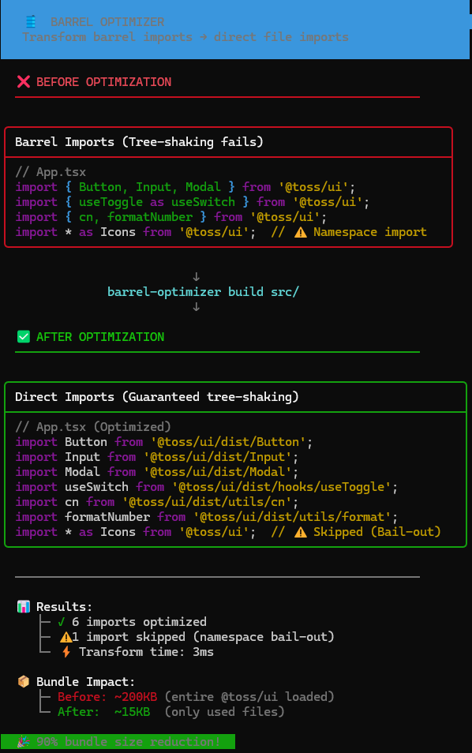

<div align="center">

# 🛢️ Barrel Optimizer

**Zero-Overhead Barrel File Optimizer for Better Tree-Shaking**

[](https://www.typescriptlang.org/)
[](https://nodejs.org/)
[](https://opensource.org/licenses/MIT)
[](http://makeapullrequest.com)

[Features](#-features) • [Installation](#-installation) • [Usage](#-usage) • [Documentation](#-documentation)

</div>

---

## 🤔 The Problem

**Barrel files** are convenient for organizing exports, but they **kill tree-shaking** in bundlers:

```typescript
// 📦 @toss/ui/index.js (Barrel File)
export { Button } from './dist/Button.js';
export { Input } from './dist/Input.js';
export { Modal } from './dist/Modal.js';
// ... 500+ more components
```

```typescript
// 🚨 Your code - you only need Button!
import { Button } from '@toss/ui';

// What the bundler does:
// 1. Loads @toss/ui/index.js
// 2. Parses ALL 500+ re-exports
// 3. Tries tree-shaking but often fails
// 4. Result: 200KB+ bundle instead of 5KB
```

### Why Tree-Shaking Fails

- Bundlers can't determine **side-effects** in barrel files
- **Dynamic re-exports** (`export *`) are hard to analyze statically
- **Circular dependencies** between modules confuse dead-code elimination

---

## ✨ The Solution

**Barrel Optimizer** transforms barrel imports into **direct file imports** at build time.



<details>
<summary>📝 Text Version (Before vs After)</summary>

<table>
<tr>
<td width="50%">

### ❌ Before

```typescript
import { Button, Input } from '@toss/ui';
import { Modal as Dialog } from '@toss/ui';
import { useToggle } from '@toss/ui';
```

</td>
<td width="50%">

### ✅ After

```typescript
import Button from '@toss/ui/dist/Button.js';
import Input from '@toss/ui/dist/Input.js';
import Dialog from '@toss/ui/dist/Modal.js';
import useToggle from '@toss/ui/dist/hooks/useToggle.js';
```

</td>
</tr>
</table>

</details>

**Result**: Bundler loads **only what you use**. Guaranteed tree-shaking. 🌳

---

## 🎯 Features

| Feature | Description |
|---------|-------------|
| 🔧 **Zero-Configuration** | Auto-discovers file paths from `node_modules`. No regex config needed. |
| 🎯 **Named Import Optimization** | Transforms `{ Button }` imports to direct file paths |
| 🛡️ **Safety-First Bail-out** | Skips `import * as` and dynamic imports with warnings |
| ⚡ **Blazing Fast** | Uses `es-module-lexer` + `@swc/core` for maximum speed |
| 📦 **Nested Barrel Support** | Handles `export * from './hooks'` recursively |
| 🔄 **Circular Dependency Safe** | DFS with visited set prevents infinite loops |

---

## 📦 Installation

```bash
# npm
npm install -D barrel-optimizer

# yarn
yarn add -D barrel-optimizer

# pnpm
pnpm add -D barrel-optimizer
```

---

## 🚀 Usage

### Analyze a Library

Discover all exports from a barrel file:

```bash
npx barrel-optimizer analyze @toss/ui
```

**Output:**
```
✓ Found 500 exports in 45ms

Export Map:
  dist/Button.js     → Button
  dist/Input.js      → Input
  dist/Modal.js      → Modal
  dist/hooks/useToggle.js → useToggle
  ...
```

### Optimize Imports (Dry Run)

Preview transformations without modifying files:

```bash
npx barrel-optimizer optimize src/ --library @toss/ui --verbose
```

### Apply Optimizations

Write changes to files:

```bash
npx barrel-optimizer build src/ --library @toss/ui
```

### CLI Options

```
Options:
  -l, --library <names...>   Libraries to optimize (default: ["@toss/ui"])
  -w, --write                Write changes to files
  -v, --verbose              Show detailed output
  --cwd <path>               Working directory
  -h, --help                 Display help
```

---

## 🔒 Safety: Bail-out Cases

The optimizer **skips** potentially unsafe patterns:

| Pattern | Action | Reason |
|---------|--------|--------|
| `import * as UI from '@toss/ui'` | ⚠️ Skip + Warn | Can't determine which exports are used |
| `import '@toss/ui'` | ⏭️ Skip | Side-effect only import |
| `const UI = await import('@toss/ui')` | ⏭️ Skip | Dynamic import |

---

## 📊 Benchmark

Tested with a mock `@test/ui` library (8 components, nested barrels):

| Metric | Value |
|--------|-------|
| Exports Discovered | 8 |
| Analysis Time | 16ms |
| Transform Time | 3ms |
| Import Statements Optimized | 4 |

**Real-world estimate** with `@toss/ui` (500+ components):
- Analysis: ~50ms
- Bundle size reduction: **~90%** of unused code eliminated

---

## 📚 Documentation

| Document | Description |
|----------|-------------|
| [📐 Architecture](./docs/ARCHITECTURE.md) | Technical deep-dive into the two-phase pipeline |
| [🗺️ Roadmap](./docs/ROADMAP.md) | Project plan, milestones, and future features |
| [🔧 Troubleshooting](./docs/TROUBLESHOOTING.md) | Common issues and solutions |

---

## 🏗️ How It Works

```
┌─────────────────────────────────────────────────────────────┐
│                     Phase 1: Analyzer                        │
│                                                              │
│  package.json → Entry Point → DFS Traverse → ImportMap      │
│                                    ↓                         │
│                              Visited Set                     │
│                        (Circular Dep Prevention)             │
└─────────────────────────────────────────────────────────────┘
                              ↓
┌─────────────────────────────────────────────────────────────┐
│                    Phase 2: Transformer                      │
│                                                              │
│  Source Code → SWC Parse → Match ImportMap → Rewrite AST    │
│                     ↓                                        │
│              Bail-out Check                                  │
│         (Namespace/Dynamic Import)                           │
└─────────────────────────────────────────────────────────────┘
```

---

## 🛠️ Tech Stack

- **[es-module-lexer](https://github.com/guybedford/es-module-lexer)** - Fast export parsing without AST
- **[@swc/core](https://swc.rs/)** - Rust-based AST transformation (20x faster than Babel)
- **[commander](https://github.com/tj/commander.js)** - CLI framework
- **[chalk](https://github.com/chalk/chalk)** - Terminal styling
- **TypeScript** - Strict mode enabled

---

## 🤝 Contributing

Contributions are welcome! Please read our contributing guidelines before submitting a PR.

1. Fork the repository
2. Create your feature branch (`git checkout -b feature/amazing`)
3. Commit your changes (`git commit -m 'Add amazing feature'`)
4. Push to the branch (`git push origin feature/amazing`)
5. Open a Pull Request

---

## 📄 License

MIT © 2024

---

<div align="center">

**Made with ❤️ for better bundle sizes**

[⬆ Back to top](#-barrel-optimizer)

</div>
